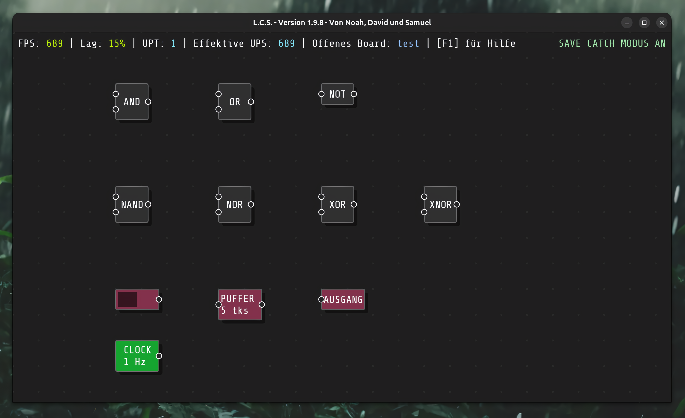
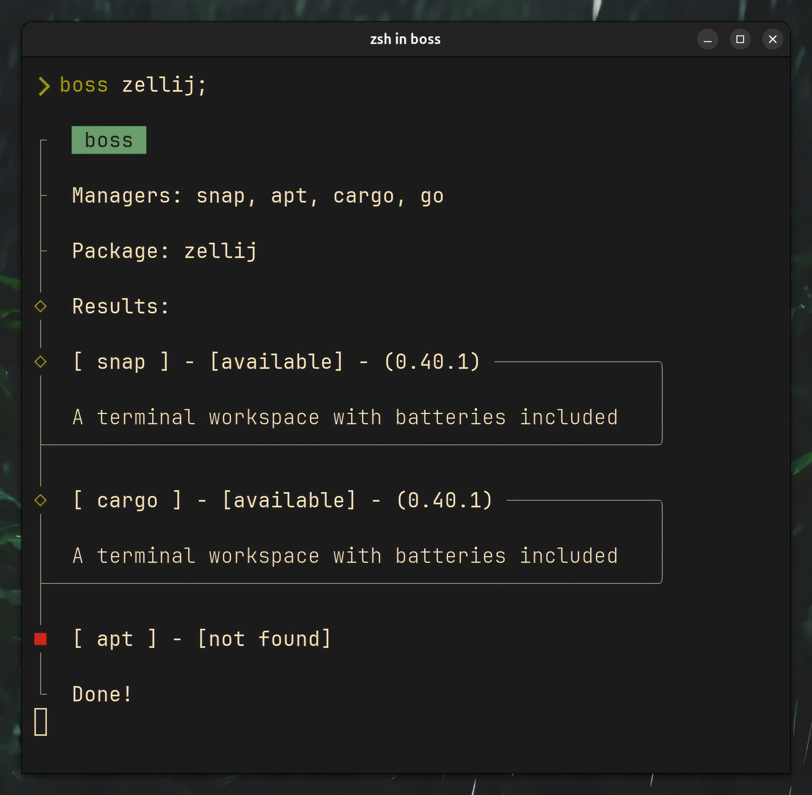

# L.C.S.
<Frame caption="Showcase Board">
  
</Frame>

__L.C.S.__ steht für "Logic Circuit Simulator" und ist ein _Proof of Concept_ Prototyp, den ich im Rahmen eines Schulprojektes entwickelte.

L.C.S. ist in Lua (und teilweise in Moonscript) geschrieben und verwendet das Love2D Framework.
Da es wie gesagt nur ein Proof of Concept Schulprojekt ist, wurde die Entwicklung nach dem Schuljahr eingestellt und wird vorerst auch nicht wieder aufgenommen. Hier ist der [Link zum Repository](https://github.com/LogicCircuitSim/LCS/tree/menu-update).

In diesem Dropdown gibt es die ganze Geschichte über das Projekt:

<Accordion title="Geschichte von L.C.S.">
  WIP!
  - team aus 3
  - zuerst die planung in trello
  - anforderungen aus eigenen ideen + lehrerin
  - inspirationen: boolr, dls
  - zuerst java und lwjgl
  - zu sehr auf gui fokussiert
  - probleme mit imgui (weil es nur bindings waren)
  - dann wechsel zu love2d
  - zu sehr an objektorientierung festgehalten
  - dann moonscript
  - trotz chaos in der entwicklung: fertigstellung
  - dann abgabe
  - dann präsentation
</Accordion>

# boss
<Frame caption="Zellij Query">
  
</Frame>

__boss__ ist ein Terminal Programm, das als eine Art "wrapper" für verschiedene Package Manager auf Linux dient.

boss ist in Rust geschrieben, da sich Rust als eine moderne Alternative zu herkömmlichen C Programmen im Bezug auf CLI Tools erwiesen hat. Siehe [hier](https://www.rust-lang.org/what/embedded).

boss ist ein Projekt, das ich in meiner Freizeit entwickle und es ist noch nicht fertig. Hier ist der [Link zum Repository](https://github.com/NQMVD/boss)

<Accordion title="Geschichte von boss">
- zuerst bash
- dann nushell "checker"
- dann rust
- direkt mit cliclack
- dann die manager
- dann besseres error handling mit results
- dann bessere struktur
- dann mehr manager
- dann verbesserte struktur
-> alles in github repo commits
</Accordion>

## andere
- shellscripts
- dotfiles
- github
